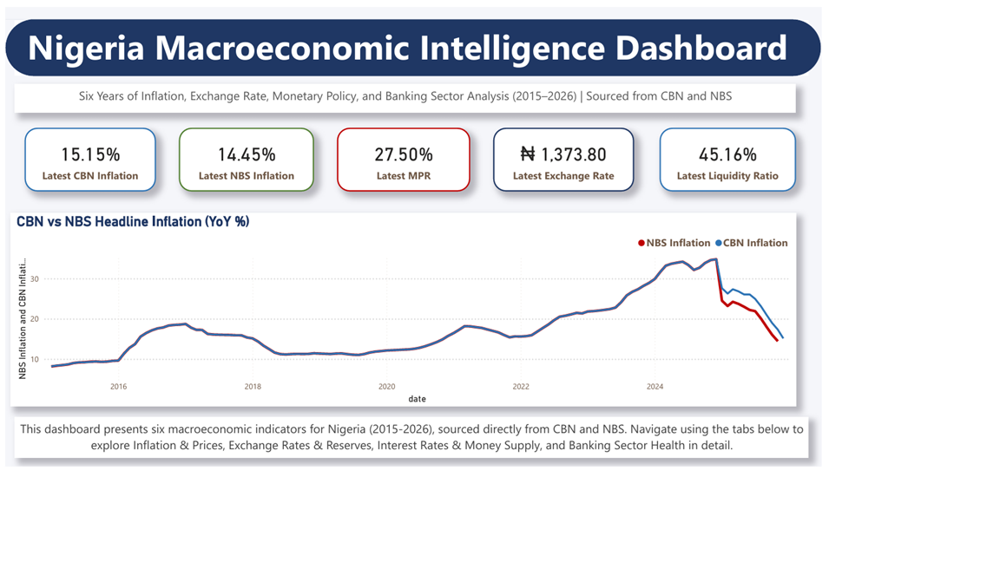
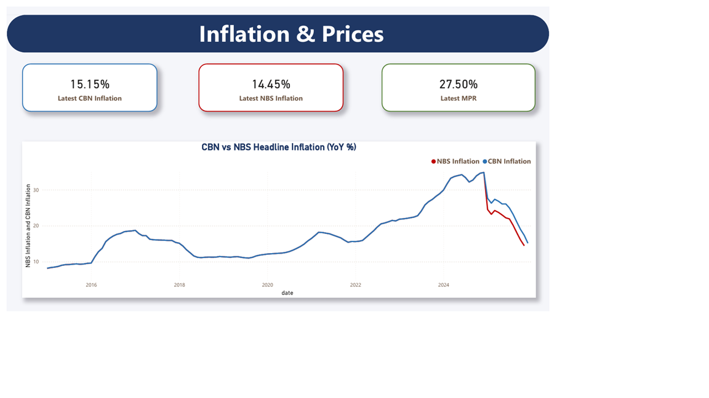
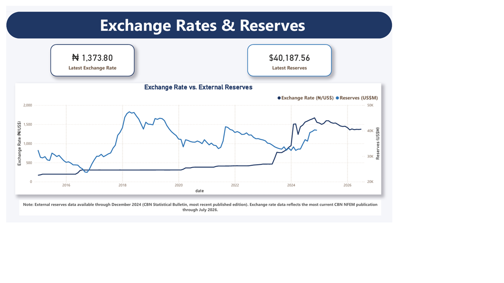
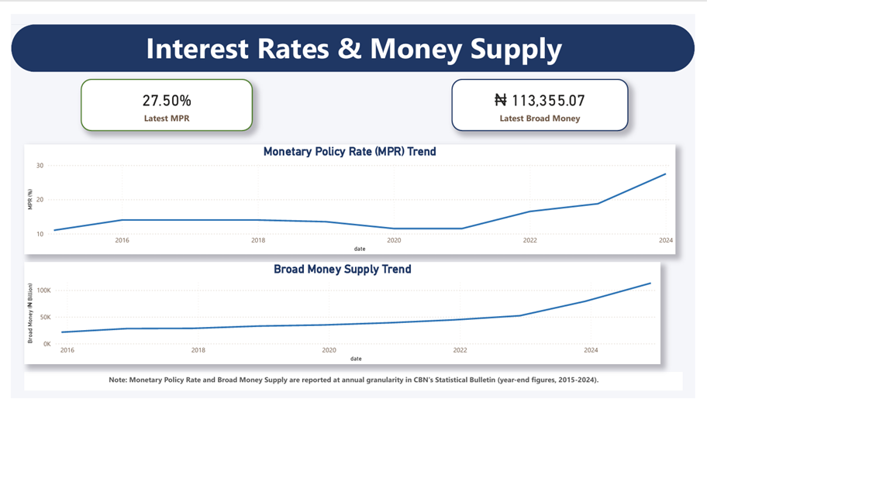
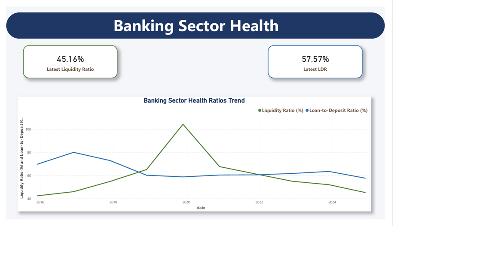

# Nigeria Macroeconomic Intelligence Dashboard

**An end-to-end macroeconomic analytics platform built on real CBN and NBS data — engineered for policy analysis, economic research, and evidence-based decision-making.**

[](https://www.python.org/)
[](https://www.sqlite.org/)
[]()
[](LICENSE)

## Overview

Nigeria's macroeconomic data is publicly available — but it is scattered, inconsistently formatted, and rarely analyzed rigorously in one place. This project builds a production-grade pipeline that ingests real Central Bank of Nigeria (CBN) and National Bureau of Statistics (NBS) data, cleans it to analysis-ready standards, structures it in a relational database, surfaces policy-relevant insights through a fully interactive Power BI dashboard, and translates those findings into a formal policy brief — the kind of end-to-end work expected at institutions like the CBN, World Bank, PenCom, and ECOWAS.

This is not a toy dataset exercise. Every number in this project traces back to an official, verifiable public source.

## Dashboard Preview

### Overview


### Inflation & Prices


### Exchange Rates & Reserves


### Interest Rates & Money Supply


### Banking Sector Health


## What Makes This Different

- **Real government data, not sample datasets** — sourced directly from CBN's rate exports, CBN's Statistical Bulletins, and NBS's Nigeria Data Portal
- **Cross-source validation** — CBN and NBS both report inflation; this project surfaces and investigates where they diverge (e.g., a 2025 CPI rebasing to 2024=100 creates a measurable gap between sources — exactly the kind of nuance a policy analyst should catch, not smooth over)
- **Transparent handling of real-world data limitations** — the exchange rate series required merging two structurally different CBN rate regimes (a historical official rate and the newer NFEM rate) at a documented transition point; MPR, money supply, and banking sector ratios are reported at annual granularity in CBN's own bulletins, and this project preserves that true resolution rather than fabricating false monthly precision
- **Proper data engineering, not spreadsheet hacking** — reproducible Python ETL, a documented relational schema, and version-controlled cleaning logic for every source
- **Analysis that challenges the obvious narrative** — SQL analysis reveals the CBN's real policy rate was negative for most of 2016–2024, meaning monetary tightening was often accommodative in real terms despite aggressive nominal rate hikes
- **A fully designed, executive-grade dashboard** — 5-page Power BI report with a consistent visual system (branded headers, color-coded KPI cards, accurate unit formatting, and protected cross-filtering) built for a financial and policy audience
- **Findings translated into policy** — a formal policy brief with three evidence-based recommendations, each traced directly back to a specific analytical finding, not written independently of the data
- **Built by someone who works with data professionally** — combining a Data Analyst background with hands-on quality assurance leadership experience and postgraduate study in Public Policy and Administration

## Architecture

```
Raw Data (CBN, NBS)
        ↓
Python Ingestion & Inspection  (src/ingestion/)
        ↓
Source-Specific Cleaning       (src/cleaning/)
        ↓
SQLite Star Schema Database    (src/database/)
        ↓
Analytical Queries & Insights  (src/analysis/)
        ↓
Power BI Dashboard  (dashboard/)
        ↓
Policy Brief  (policy_brief/)
```

**Database design:** a `dim_date` dimension table joined to seven per-source fact tables (`fact_cbn_inflation`, `fact_nbs_cpi`, `fact_exchange_rate`, `fact_mpr`, `fact_money_supply`, `fact_reserves`, `fact_banking_ratios`), enabling clean time-series joins across every economic indicator in the project.

**Analytical layer:** 8 SQL queries in `src/analysis/analytical_queries.py`, using CTEs and window functions to compute moving averages, year-over-year growth rates, cross-source gaps, and before/after policy-shock comparisons.

**Visualization layer:** a 5-page Power BI dashboard (`dashboard/nigeria_macro_dashboard.pbix`) covering an executive Overview plus dedicated pages for Inflation & Prices, Exchange Rates & Reserves, Interest Rates & Money Supply, and Banking Sector Health.

**Policy layer:** a 3-page policy brief (`policy_brief/Nigeria_Macro_Policy_Brief.docx`) with three recommendations, each grounded in a specific SQL finding from the analytical layer.

## Tech Stack

| Layer | Tools |
|---|---|
| Ingestion & Cleaning | Python, Pandas, openpyxl, python-calamine |
| Database | SQLite (star schema) |
| Analysis | SQL (CTEs, window functions, multi-table joins) |
| Visualization | Power BI |
| Policy Writing | Structured policy brief, Word format |

## Project Status: Complete

- [x] Environment and repository setup
- [x] CBN inflation data — ingested, cleaned, validated (2015–2025, monthly)
- [x] NBS CPI data — ingested, cleaned, validated (2015–2025, monthly)
- [x] SQLite star schema database with joined fact tables
- [x] Exchange rate data (2015–2026, monthly, merged across historical and NFEM regimes)
- [x] Interest rates (MPR) — annual, 2015–2024
- [x] Money supply (Broad Money) — annual, 2015–2024
- [x] External reserves (2015–2024, monthly)
- [x] Banking sector health metrics — liquidity ratio and loan-to-deposit ratio, annual, 2015–2024
- [x] 8 advanced analytical SQL queries (inflation trends, cross-source validation, real policy rate, money supply-inflation link, post-subsidy impact, FX-reserves relationship, banking health)
- [x] 5-page Power BI dashboard (Overview, Inflation & Prices, Exchange Rates & Reserves, Interest Rates & Money Supply, Banking Sector Health)
- [x] Policy brief with three evidence-based recommendations

## Key Findings & Recommendations

- Cross-referencing CBN and NBS headline inflation reveals a precise structural break: every month before January 2025 matches exactly (0.00 gap), while every month from January 2025 onward shows a consistent **2.9–3.9 percentage point gap** — a clean, dated signature of NBS's CPI rebasing to a 2024=100 base year.
- The CBN's **real policy rate** (MPR minus inflation) was negative in 7 of the last 9 years, reaching **-10.17 percentage points in 2023** — meaning that despite aggressive nominal rate hikes (11% to 27.5%), Nigerian monetary policy was often accommodative rather than restrictive in real terms.
- Broad Money supply growth spiked to **51.86% in 2023** and **43.03% in 2024** — far above any prior year in the dataset — coinciding precisely with the period of highest recorded inflation (28.92% and 34.80%).
- In the 12 months following the May 2023 fuel subsidy removal, average inflation rose from **21.15% to 28.86%**, and the average exchange rate more than doubled, from **₦444.79 to ₦1,005.87** per US dollar.
- Despite this volatility, commercial banks' liquidity ratio and loan-to-deposit ratio remained within regulatory bounds in every single year from 2015 to 2024, suggesting the banking sector absorbed the macro shocks without a systemic liquidity crisis.

Based on this evidence, the [policy brief](policy_brief/Nigeria_Macro_Policy_Brief.docx) recommends: (1) anchoring MPR decisions to a real, inflation-adjusted target rather than a nominal one; (2) sequencing major fiscal and monetary reforms with an explicit money supply ceiling; and (3) establishing a joint CBN-NBS inflation reconciliation statement following methodology changes.

## Getting Started

```bash
# Clone the repository
git clone https://github.com/Amimu-1/nigeria-macro-intelligence-dashboard.git
cd nigeria-macro-intelligence-dashboard

# Set up the environment
python -m venv venv
venv\Scripts\activate      # Windows
pip install -r requirements.txt

# Run the pipeline
python src/cleaning/clean_cbn_inflation.py
python src/cleaning/clean_nbs_cpi.py
python src/cleaning/clean_cbn_exchange_rate.py
python src/cleaning/clean_cbn_exchange_rate_historical.py
python src/cleaning/merge_exchange_rate.py
python src/cleaning/clean_cbn_mpr.py
python src/cleaning/clean_cbn_money_supply.py
python src/cleaning/clean_cbn_reserves.py
python src/cleaning/clean_cbn_banking_ratios.py
python src/database/build_database.py

# Explore the data and run the analytical queries
python src/analysis/analytical_queries.py

# Open the dashboard (requires Power BI Desktop)
# dashboard/nigeria_macro_dashboard.pbix

# Read the policy brief
# policy_brief/Nigeria_Macro_Policy_Brief.docx
```

## Data Sources

- [CBN Data & Statistics](https://www.cbn.gov.ng/rates/)
- [CBN Statistical Bulletin](https://www.cbn.gov.ng/documents/Statbulletin.html)
- [Nigeria Data Portal (NBS)](https://nigeria.opendataforafrica.org/)

## About the Author

**Aminu Momodu Audu** — Data Analyst based in Abuja, Nigeria, with a background combining quantitative analytics and public policy. Formerly a Data Analyst Intern at Bluestock Fintech, where he built a 92-company financial intelligence platform with 50+ KPIs and 320 passing tests. Currently pursuing an MPPA at Bayero University Kano, bringing a policy lens to data work most technical portfolios lack.

- GitHub: [github.com/Amimu-1](https://github.com/Amimu-1)
- LinkedIn: [linkedin.com/in/aminu-momodu-audu-040359406](https://linkedin.com/in/aminu-momodu-audu-040359406)

---

*This project is complete and actively maintained. Star or watch the repo to follow future updates.*
